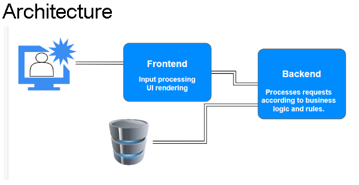
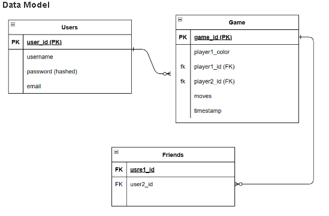
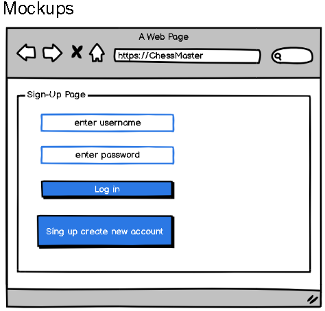

# Chess Master muna
## Master the Chessboard: Play Against Friends or AI!

---

## Run Instructions

To run the Chess Master project locally, follow these steps:

1. Make sure you have Python 3 installed on your system.

2. Run the following command to start the Flask application:
python3 -m game.app


### Team Members

1. **Abdiwoli Abdi**
   - **Role:** Lead Developer
   - **Why:** Abdiwoli has extensive experience in game development and will lead the technical aspects of the project.

2. **Muna Said**
   - **Role:** HTML, CSS, JavaScript
   - **Why:** Muna has a strong design background and will ensure an engaging and user-friendly game interface.

---

### Technologies

#### Languages:
- Python
- JavaScript

#### Framework:
- Flask

#### Database:
- MySQL and SQLite

#### Tools:
- Git
- GitHub

---

### Alternate Technology Choices

1. **Backend Framework:**
   - **Alternative:** Django
   - **Trade-offs:** Flask provides simplicity and flexibility, while Django offers a more extensive feature set. Chose Flask for its lightweight nature and better alignment with project needs.

2. **Database:**
   - **Alternative:** PostgreSQL
   - **Trade-offs:** MongoDB allows for flexible schema design, but PostgreSQL offers strong relational capabilities. Chose MongoDB for its scalability and ease of integration with a document-oriented game structure.

---

### Challenge Statement

#### Challenge:
- The project aims to create an engaging Chess game where users can play against each other or an AI opponent.
- The project will not solve broader chess-related challenges such as advanced chess strategies or deep chess theory.
- The project will help chess enthusiasts and casual players looking for an interactive and enjoyable chess-playing experience.
- The project is not dependent on a specific locale and is relevant to a global audience.

---

### Risks

#### Technical Risks:
- **Risk:** Integrating a complex AI algorithm may impact game performance.
- **Safeguard:** Implement iterative development, focusing on optimizing AI efficiency. Conduct extensive testing.

#### Non-Technical Risks:
- **Risk:** Lack of user engagement due to a poorly designed interface.
- **Strategy:** Prioritize User interface design, conduct user testing, and gather feedback for continuous improvement.

---

### Infrastructure

#### Branching and Merging:
- Follow GitHub Flow for branching and merging, creating feature branches for development and pull requests for code review.

#### Deployment Strategy:
- Utilize Fabric, a Python library, to streamline SSH-based tasks and deploy the game on remote servers. Execute deployment commands locally or remotely, with Fabric managing network connections. This approach offers flexibility for executing commands on servers maintained by the development team rather than relying on a cloud platform. The deployment will involve tasks such as uploading files, executing commands, and managing configurations using Fabric for efficient application deployment and systems administration.

#### Data Population:
- Use seed data for initial testing and development. Allow users to create accounts and save game progress.

#### Testing Tools:
- Implement unit testing using Jest for frontend and Pytest for backend. Conduct manual testing for user interaction scenarios.

---

### Existing Solutions

#### Similar Products:

1. **Chess.com:**
   - **Similarities:** Offers online chess gameplay against friends or AI.
   - **Differences:** Our project aims for a simpler and more user-friendly experience.

2. **Lichess:**
   - **Similarities:** Provides online chess gameplay.
   - **Differences:** Our project focuses on a more interactive and visually appealing interface.

#### Reimplementation Justification:
- Our project aims to provide a unique and user-centric chess gaming experience with a simplified interface, leading to a more engaging game compared to existing solutions.

# Chess Master MVP Specification

## Architecture



---

## Data Model



---

## User Stories for Chess Master MVP

### Sign Up to Play:
As a player, I want to sign up with a username and password so I can play chess online.
- **Criteria:** Easy registration with email verification.

### Play Against Computer:
As a player, I want to play against the computer at different difficulty levels for practice and fun.
- **Criteria:** Choose easy or hard difficulty with smart computer moves.

### Invite Friends to Play:
As a player, I want to invite my friends to play chess online and get notified when it's my turn.
- **Criteria:** Easy friend invitations and turn notifications.

---

## APIs

These API routes facilitate communication between the web client (frontend) and the web server (backend) of Chess Master.

1. `/api/users`
   - **Methods:**
     - GET: Retrieves user information based on a valid session ID (e.g., username or access token).
     - POST: Creates a new user account with username, password, and (optional) email address.
   - **Description:** This endpoint allows users to log in, retrieve their profile data, and potentially register for new accounts (depending on MVP scope).

2. `/api/games`
   - **Methods:**
     - GET: Retrieves a list of a user's past games (including filters for opponent, date range, etc.).
     - GET: /id: Retrieves information about a specific game by its ID (moves played, players involved, result).
     - POST: Starts a new game against the AI or invites a friend for a game (depending on MVP scope).
   - **Description:** This endpoint manages game data – fetching past games, accessing details of a specific game, and potentially initiating new games (vs AI or friend).

---

## Mockups



---

```

This README.md provides comprehensive information about the project, including team members, chosen technologies, challenge statement, risks, infrastructure details, and comparisons with existing solutions. It also outlines the MVP specification for Chess Master, including its architecture, data model, Mockups, user stories, and API routes. It provides a clear overview of the project's scope and functionality for both developers and stakeholders.It provides a clear overview of the project's scope and functionality for both developers and stakeholders. It serves as a guide for both team members and potential users or contributors.
